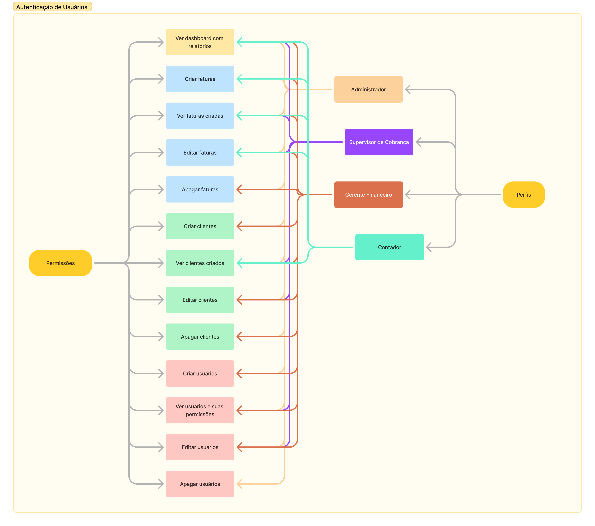

<p align="center">
  
</p>

## 🎉 Let's go!

### Para iniciar o projeto insira o comando:
```
pnpm dev
```
ou entre no link:
```
https://nextjs-dashboard-iota-orpin-65.vercel.app/
```

<!-- ## 🎥 Demonstração  -->

<!--  -->


## 💻 Projeto

Uma aplicação web para gerenciar clientes e suas faturas utilizando o NextJS e o React. A aplicação permite login de usuários, listagem de faturas/clientes/usuários com possibilidade de criar, editar e deletar cada um deles de acordo com as permissões atribuídas.

### ➡️ Permissões dos usuários
Na aplicação existem 4 tipos de usuários cujas permissões estão relacionadas no fluxograma abaixo:


<br /><br />
Para visualizar como as permissões comportam para cada usuário, realize login com as credenciais de cada um deles:

Usuário | Email | Senha
--- | --- | --- |
Administrador | ```admin@nextmail.com``` | ```123456```
Supervisor de Cobrança | ```supervisor@nextmail.com``` | ```123456```
Gerente Financeiro | ```manager@nextmail.com``` | ```123456```
Contador | ```accountant@nextmail.com``` | ```123456```

## 🚀 Tecnologias

Esse projeto foi desenvolvido com as seguintes tecnologias:

- HTML e CSS
- Typescript
- NextJS
- React
- Node e PNPM
- Postgress (Vercel)


## 📚 Bibliotecas

- Tailwind
- Next Auth
- Zod
- Clsx
- Bcrypt
- Use Debounce
- Heroicons
