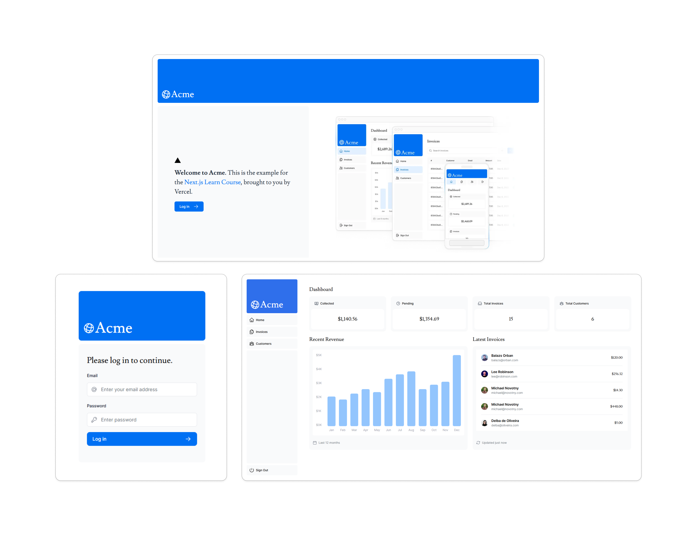

<p align="center">
  
</p>

## 🎉 Let's go!

### Para iniciar o projeto insira o comando:
```
pnpm dev
```
ou entre no link:
```
https://nextjs-dashboard-iota-orpin-65.vercel.app/
```

### Para realizar login digite as seguintes credenciais:
<br><b>Email:</b> ```user@nextmail.com```
<br><b>Senha:</b> ```123456```


<!-- ## 🎥 Demonstração  -->

<!--  -->


## 💻 Projeto

Uma aplicação web para gerenciar clientes e suas faturas utilizando o NextJS e o React. A aplicação permite login de usuários, listagem de faturas com possibilidade de criação de novas faturas, assim como atualizações e exclusões.


## 🚀 Tecnologias

Esse projeto foi desenvolvido com as seguintes tecnologias:

- HTML e CSS
- Typescript
- NextJS
- React
- Node e PNPM
- Postgress (Vercel)


## 📚 Bibliotecas

- Tailwind
- Next Auth
- Zod
- Clsx
- Bcrypt
- Use Debounce
- Heroicons
